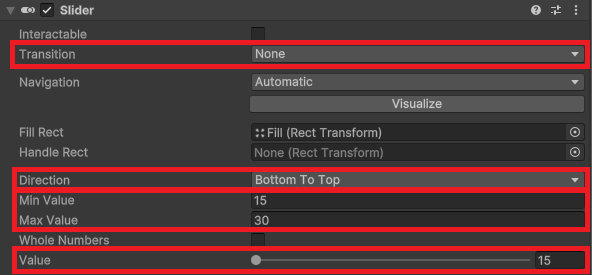
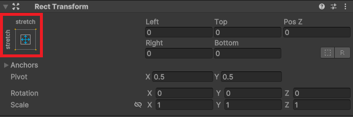
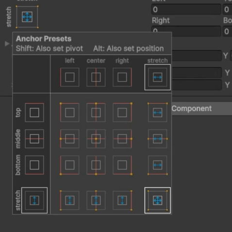

# 게임 구현 1
## 개요

- "Amazing bowling"이라는 포트리스 형태의 게임을 제작과정을 기록했다.
- 이전에는 포신을 만들고, 프리팹을 통해 포탄과 프래팹(상자)을 먼저 제작했다.
- 이번에 만들 것은 포신 UI(파워 슬라이드)를 만들고, 포탄이 발사되도록 하는 것이다.

## 구현해야 할 것
- 포신이 "Fire"키를 입력받으면 다음과 같이 행동한다.
	1. 첫번째 Fire키는 y축을 기준으로 회전한다.
	2. 두번째 Fire키는 x축을 기준으로 회전한다.
	3. 세번째 Fire키는 포탄을 얼마나 멀리 쏠지 결정한다.
- 세번째 Fire키를 입력할 때, 파워 슬라이드가 표시되도록 구현한다.
	- 필요한 것은 Slider UI와 이를 조작하기 위한 코드들이다.

## Slider
- 포신 UI를 위해 Slider를 생성한다.
- 생성할 수 있는 UI 요소 중 하나다.
- 구조는 다음과 같다.
```
Canvas
└── Slider
	├── Background
	├── Handle Slide Area
	└── Fill Area
		└── Fill
```
- 구현에는 Background와 Handle Slide Area는 필요없으므로 삭제한다.
- Canvas를 생성하면 EventSystem도 형성되는데, 구현에 필요 없기 때문에 삭제한다.
	- EventSystem은 유저의 입력을 받기 위한 요소이다.

### Setting 1: Canvas
- Canvas의 컴포넌트인 Canvas와 Canvas Scaler에서 설정을 해야 한다.


- Render mode
	- Canvas가 랜더링되는 방식을 설정한다.
	- Default로 Screen space - Overlay로 되어 있어, 게임 세상(World space)와 상관없이 표시된다.
	- World space로 변경하면, 게임 세상의 좌표에 종속되어서 랜더링된다.
- Reference pixel per unit
	- Pixel per unit과 매칭되는 값이다.
	- UI가 Scene에서 얼만큼의 크기로 표시될 지를 결정한다.
	- 기본값은 100이다.

### Setting 2: Slider
- Slider의 컴포넌트인 Slider에서 설정을 해야 한다.

- Trnasition
	- 유저의 입력에 따라 어떻게 반응하는지 결정한다.
	- Default로 Color tint라고 되어 있지만, 필요없기 때문에 None으로 설정한다.
- Direction
	- 슬라이더의 방향을 결정한다.
- Min value / Max value
	- 슬라이더의 최소값과 최대값을 설정한다.
	- 여기에서는 강의에 따라 15, 30으로 설정했다.
- Value
	- 슬라이더가 표시하고 있는 실제 값이다.
	- 이는 코드 상에서 조작할 수 있기때문에, Min value 값으로 설정한다.

### Setting 3: Fill Area

- Fill Area의 Rect Transform 컴포넌트의 Anchor presets을 클릭한다.
- Alt키를 입력한채, stretch 옵션을 선택해서 Fill Area가 Slider에 꽉 차도록 한다.


- Scene 창에서 Rect tool을 이용해 크기와 위치를 조절한다.
- Fill에서 색을 적당히 조절하면 파워 슬라이더에 대한 준비가 완료된다.

## 포탄 발사
- 포신 오브젝트의 구조는 다음과 같다.
```
Shooter pivot
├── Ball barrel model
├── Fire position
└── Canvas
```
- Shooter pivot은 빈 게임 오브젝트로, 포신의 중심점 역할을 한다.
- Ball berral model은 Cube를 기반으로 만든, 실제 우리에게 보이는 포신 모델이다.
- Fire position역시 빈 게임 오브젝트로, 포탄이 발사될 위치이다.
- Canvas는 방금 제작했던 파워 슬라이더이다.

### Setting 1: Aduio source 추가
- Shooter pivot에 Audio source 컴포넌트를 추가한다.
	- 이는 파워 슬라이드의 소리와 포신의 소리를 재생하기 위함이다.
	- Audio Clip이 카세트 테이프라면, Audio Source는 카세트 플레이어이다.

### Setting 2: 스크립트 작성
- BallShooter라는 스크립트를 작성한다.
- 포탄(ball)을 발사하는 로직은 다음과 같다.
	- Fire 버튼을 입력했을 때, 입력 중일 때, 입력을 종료한 후로 나뉜다.
		- Fire 버튼을 입력했을 때, 최소값 `_minForce`부터 시작하도록 한다.
			- 오디오는 `_sliderSound`가 나도록 한다.
		- Fire 버튼을 입력 중일 때에는 `_currentForce`를 계속 업데이트 한다.
			- UI로도 계속 업데이트 해준다.
		- Fire 버튼 입력을 종료하면 발사한다.
			- 이때, 프리팹으로 되어 있는 포탄을 인스턴스화 해서 Fire position방향으로 발사되도록 한다.
	- 발사가 한 번만 되어야 하기 때문에, 발사가 되었는지에 대한 플래그 `_isFired`를 계속 확인한다.
	- 만일 발사가 되었다면, `return`을 통해 발사를 중지한다.
```C#
private void Update() {
	if (_isFired)
		return;
	_powerSlider.value = _minForce;
	if (_currentForce >= _maxForce && !_isFired) {
		_currentForce = _maxForce;
		Fire();
	} else if (Input.GetButtonDown("Fire1")) {
		_currentForce = _minForce;
		_shooterAudio.clip = _sliderSound;
		_shooterAudio.Play();
	} else if (Input.GetButton("Fire1") && !_isFired) {
		_currentForce = _currentForce + _chargingSpeed * Time.deltaTime;
		_powerSlider.value = _currentForce;
	} else if (Input.GetButtonUp("Fire1") && !_isFired)
		Fire();
}
```