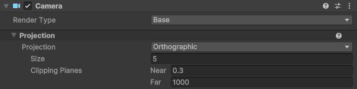
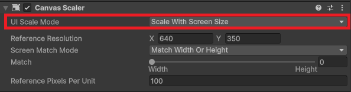
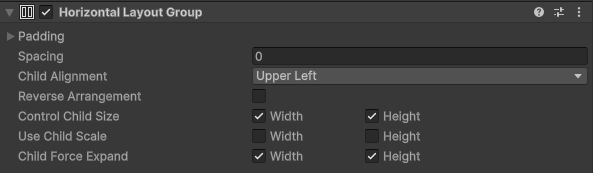

# 게임 구현 2
## 개요

- "Amazing bowling"이라는 포트리스 형태의 게임을 제작과정을 기록했다.
- 이전에는 파워 슬라이드와 포탄 발사를 구현했다.
- 이번에 만들 것은 프롭 생성기, 포탄에 대한 카메라 추적, 게임 메니저이다.

## 구현할 것
1. Generator
	- 특정 범위에서 프롭 여러개를 생성한다.
	- 각 프롭의 위치는 랜덤하다.
2. 카메라 추적
	- 포탄이 발사 되기 전에는 포신을 촬영한다.
	- 포탄이 발사되면 포탄을 추적한다.
	- 포탄이 제거(폭파)되면 추적을 멈춘다.
3. 게임 메니저 생성

## Generator

### Setting 1: Game Object 생성
- 우선 빈 게임 오브젝트를 생성한다.
- 여기에 Box collider 컴포넌트를 추가한다.
	- 이는 충돌 처리를 위함이 아니라 프롭이 생성되는 범위를 표시하는 용도이다.
	- 크기는 x: 50, y: 2, z: 50으로 설정한다.

### Setting 2: 스크립트 작성
- SpwanGenerator라는 스크립트를 작성한다.
- 루틴은 다음과 같다.
	- 게임 오브젝트 위치를 중심으로, x축과 z축으로 25만큼의 공간을 잡는다.
	- 그 공간에 프롭 100개를 랜덤하게 Spawn한다.
		- 작은 것과 큰 것중에 랜덤으로 하나를 고른다.
		- 선택된 프롭에 대한 위치를 설정한다.
		- `instantiate`를 통해 생성한다.
	- 생성된 프롭들은 포탄에 의해 파괴 되었을 때, enable이 false가 된다.
		- 이는 모든 프롭이 삭제되고 다시 생성하는 것이 성능적으로 부담이 되기 때문이다.
		- 때문에 다음 라운드에서는 true로 변경하기만 하면 된다.

```C#
private void Start() {
	_area = GetComponent<BoxCollider>();
	for (int i = 0; i < count; i++)
		Spawn();
	_area.enabled = false;
}

private void Spawn() {
	int selection = Random.Range(0, _propPrefabs.Length);
	GameObject selectedPrefab = _propPrefabs[selection];
	Vector3 spawnPosition = GetRandomPosition();
	GameObject instance = Instantiate(selectedPrefab, spawnPosition, Quaternion.identity);
	_props.Add(instance);
}

private Vector3 GetRandomPosition() {
	Vector3 basePosition = transform.position;
	Vector3 size = _area.size;
	float positionX = basePosition.x + Random.Range(-size.x / 2f, size.x / 2f);
	float positionY = basePosition.y + Random.Range(-size.y / 2f, size.y / 2f);
	float positionZ = basePosition.z + Random.Range(-size.z / 2f, size.z / 2f);
	return new Vector3(positionX, positionY, positionZ);
}
```

## Camera

### Setting 1: 추적용 Object 생성
- Main Camera 오브젝트에 보면, Camera 컴포넌트가 있다.

	- Camara 컴포넌트에 Projection 설정이 있는데, 이는 두가지 옵션으로 나뉜다.
		- Perspective - 소실점이 있는 카메라
		- Orthographic - 소실점이 없는 카메라
	- Orthographic으로 설정
- 카메라가 포탄과의 일정한 거리를 두면서 추적해야 한다.
	- 때문에, Rig이라는 빈 게임 오브젝트를 생성한다.
	- 그리고 Rig의 자식으로 Main camera를 둔다.
```
Rig
└── Main Camera
```

### Setting 2: 스크립트 작성
- Rig에서 CamFollow라는 스크립트를 작성한다.
- 카메라의 추적 로직은 다음과 같다.
	- 카메라의 상태는 3가지로 나뉜다.
		- 라운드가 시작될 때
		- 포탄이 발사되기 전
		- 포탄을 추적할 때
```C#
public enum State {
	Idle, Ready, Tracking
};
```

- 카메라에 대한 스크립트는 움직임(Move)과 줌(Zoom)만 설정하고, 실제 조작은 게임메니저가 진행한다.
	- 타겟이 사라질 때까지 Move, Zoom한다.
	- Move, Zoom 모두 `SmoothDump`를 이용해서 부드러운 움직임이 되도록 한다.

```C#
private void Move() {
	Vector3 smoothPosition;
	_targetPosition = _target.transform.position;
	smoothPosition = Vector3.SmoothDamp(transform.position,
		_targetPosition,
		ref _lastMovingVelocity,
		_smoothTime);
	transform.position = smoothPosition;
}

private void Zoom() {
	float smoothZoomSize = Mathf.SmoothDamp(_camera.orthographicSize,
		_targetZoomSize,
		ref _lastZoomSpeed,
		_smoothTime);
	_camera.orthographicSize = smoothZoomSize;
}
```

## UI

### Setting 1: Canvas 생성
- Canvas를 생성한다.
	- Canvas에는 Canvas Scaler라는 컴포넌트가 있다.

	
	- 여기에 UI scale mode라는 설정이 있다.
		- Constant pixel size는 해상도와 관계없이 UI의 크기가 고정된다.
		- Scale with screen size는 해상도에 따라 UI의 크기가 변경된다.
- Canvas의 자식으로 Panel을 생성한다.

```
Canvas
└── Info bar
	├── Best score text
	└── Score text
```

- 점수를 표시하기 위한 패널이다.
	- Panel의 자식으로 두 개의 텍스트를 생성한다.
	- 두 자식 - 텍스트를 정렬하기 위해 Horizontal Layout Group 컴포넌트를 추가한다.

	

	- Child Force Expand를 통해서 자식들을 부모의 크기에 맞추어 크기를 조절할 수 있다.
- Canvas의 또 다른 자식으로 Panel을 생성한다.
	- Ready 라는 텍스트를 출력하기 위한 패널이다.

```
Canvas
├── Info bar
|	├── Best score text
|	└── Score text
└── Round ready panel
	└── Read text
```

## Game Manager

### Setting 1: Round 별 관리
- Game manager라는 빈 게임 오브젝트를 생성한다.
- 게임 메니저는 라운드 별로 상황을 관리한다.
- 라운드(페이지)에는 3가지 상황이 있다.
	1. Ready
		- 카메라, 포신, 점수, UI 등을 리셋한다.
		- 대기시간을 가진다.
	2. Play
		- 포탄을 발사한다.
		- 포탄이 폭발될 때까지 무한 루프
	3. End
		- 포신을 비롯한 조작이 가능한 오브젝트에 대해서 조작이 불가능하게 한다.
		- 리셋한 뒤에 Ready로 넘어간다.
		- 대기시간을 가진다.

### Setting 2: 스크립트 작성
- GameManager라는 스크립트를 작성한다.
- 게임 메니저는 단 하나여야 하기 때문에 싱글톤 패턴을 사용한다.
- 라운드에 대한 조작은 코루틴을 사용한다.