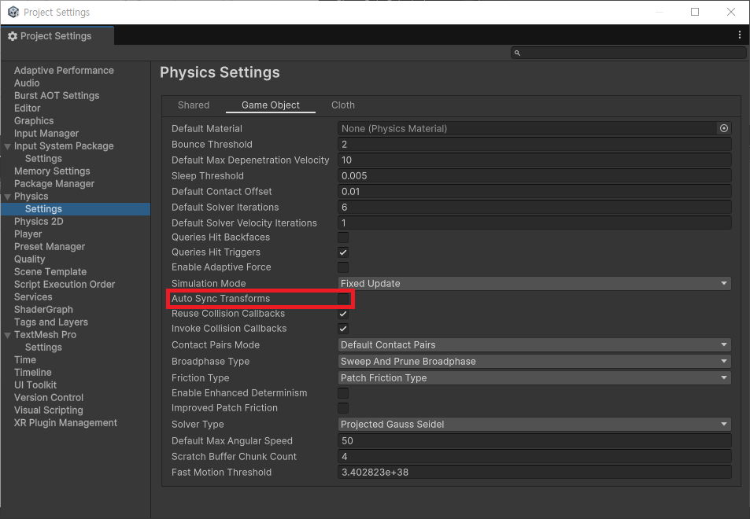
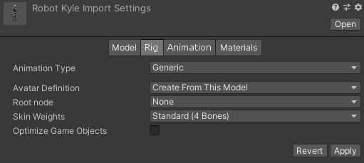

# Transform
> [이 영상](https://youtu.be/QtmGT-22PqA?feature=shared)을 보고 정리한 글입니다.<br>
> 마지막 이미지의 출처는 [여기](https://rito15.github.io/posts/unity-optimize-model-transform/)에 있습니다.

## 유니티의 구조
- 유니티는 크게 3가지의 모듈로 나뉘어져 있다.
	1. C# API
	2. C++ Engine
	3. Physics, Box2D/Physicx
- 세개의 모듈은 각자 따로 동작하는 것이 아닌, 계속해서 동기화를 한다.
	- 가령, `rigidbody.AddForce`를 하게 된다면, Physics 계층에서 움직임이 발생하고, C++ Engine에서 동기화가 이루어 진다.

## Transform의 특징
- Transform에는 `position`, `rotation`, `size` 요소가 있다.
- 이 요소들은 따로 관리되는 것이 아닌, 하나의 행렬(4*4)로 관리된다.
- 때문에, Transform의 요소를 따로 갱신하게 되면, 하나의 행렬을 두번 갱신하게 된다.

```C#
void Update() {
	transform.position += new Vector3(1f, 1f, 1f); // 행렬 한 번 갱신
	transform.rotation += Quaternion.Euler(45f, 45f, 45f); // 한 번 더 갱신
}
```

- 때문에, 명시적인 함수를 사용하거나 최대한 한 군데에서 처리하는 것이 좋다

```C#
void Update() {
	transform.SetPositionAndRotation(
		transform.position + new Vector3(1f, 1f, 1f),
		transform.rotation + Quaternion.Euler(45f, 45f, 45f)
	);
}
```

### Rigidbody와 함께 사용하는 경우
- Rigidbody는 Physics계층의 요소이지만, Transform은 C++ Engine 요소이다.
- 때문에, 이들은 각자 갱신을 하고 서로 동기화를 진행하게 되고, 동일한 데이터에 대해서 필요 이상의 연산이 들어가게 된다.
- 이에 대한 해결책으로는 두가지가 있다.
	1. Rigidbody를 중심으로 갱신을 하던지, Transform을 중심으로 갱신을 해야 한다.
	2. Project Settings > Physics Settings > Auto Sync Transforms
		- 자동적인 동기화를 최대한 줄이는 설정으로, 대부분을 수동적으로 동기화를 제어해야한다.



### 계층 구조에서의 Transform
- 하나의 오브젝트 내부에 여러 개의 자식 오브젝트가 있는 상태라고 가정해보자.
```
Parent
├── Child 1
|	├── Child 1-1
|	|	├── Child 1-1-1
..
|	|	└──  Child 1-1-n
|	├── Child 1-2
..
|	└── Child 1-n
├── Child 2
..
```
- 이때, 부모 오브젝트의 Transform을 갱신하게 되면, 자식 오브젝트의 모든 Transform이 갱신되어야 한다.
- 때문에, 가능한 오브젝트의 구조를 복잡하게 하지 않는 것이 좋다.
- 그럼에도 불구하고, *캐릭터*처럼 어쩔 수 없이 복잡한 구조를 가질 수 밖에 없는 경우가 있다.
	- 이러한 경우에는 Rig에 있는 Optimize game object 옵션을 사용한다.
	- 이를 사용하게 되면, 오브젝트의 계층이 평면화(배열화)되어서 오버헤드를 줄일 수 있게 된다.

